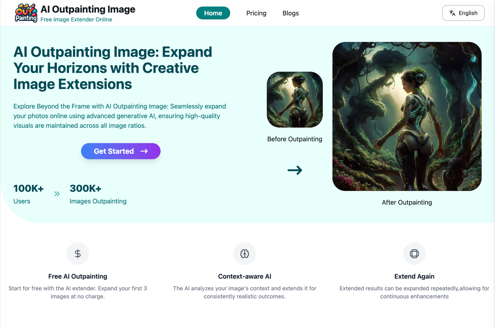
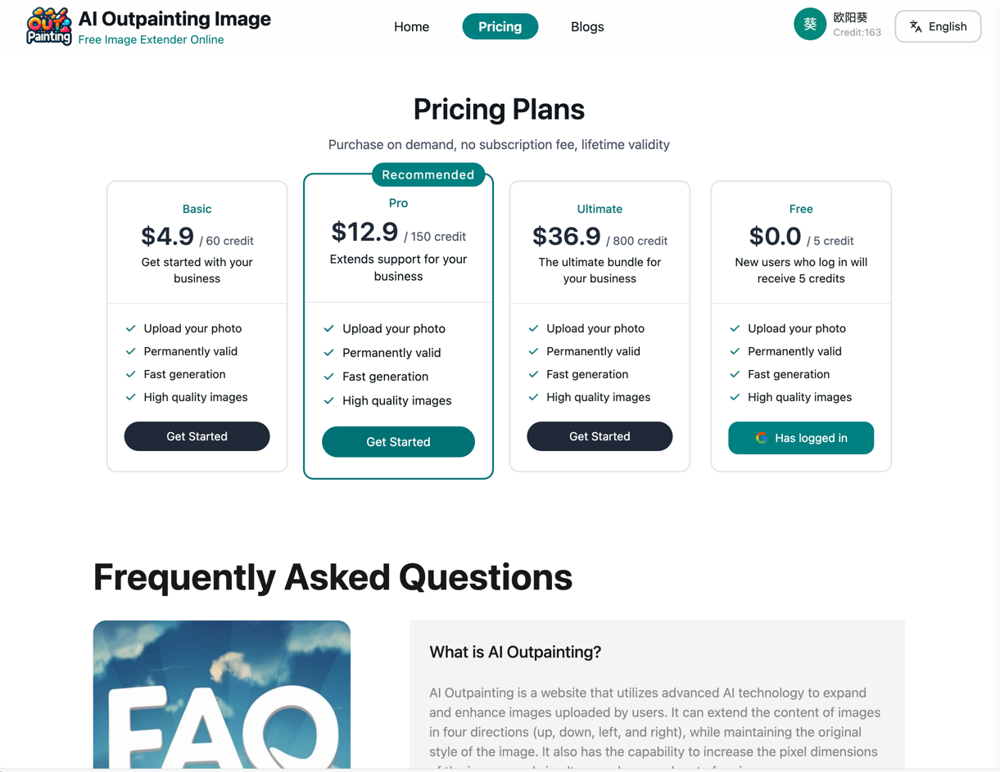
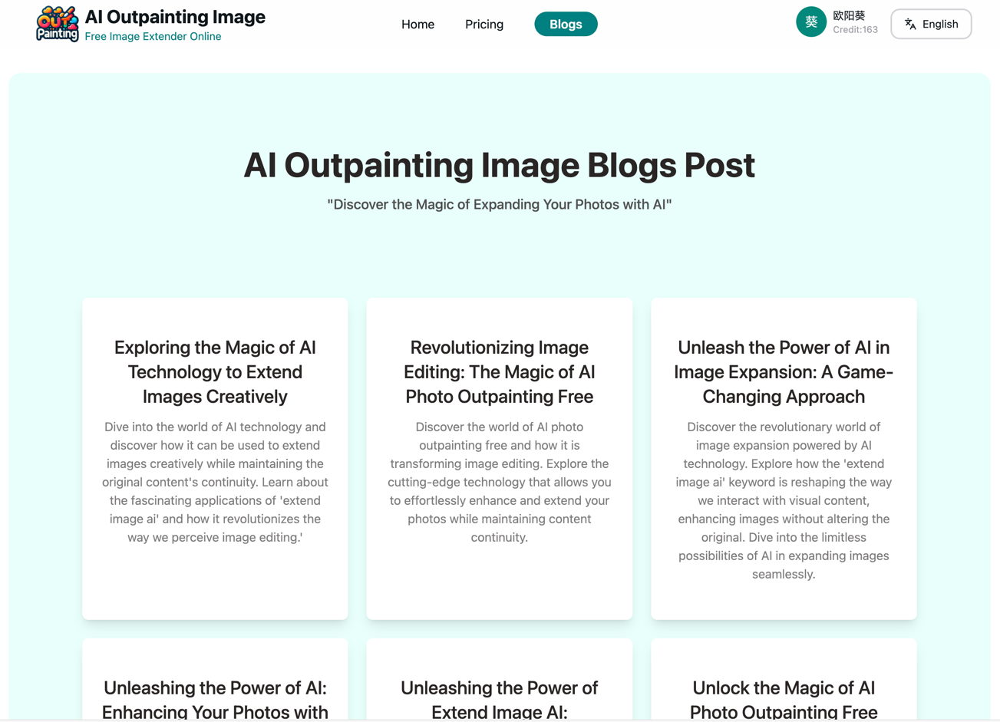
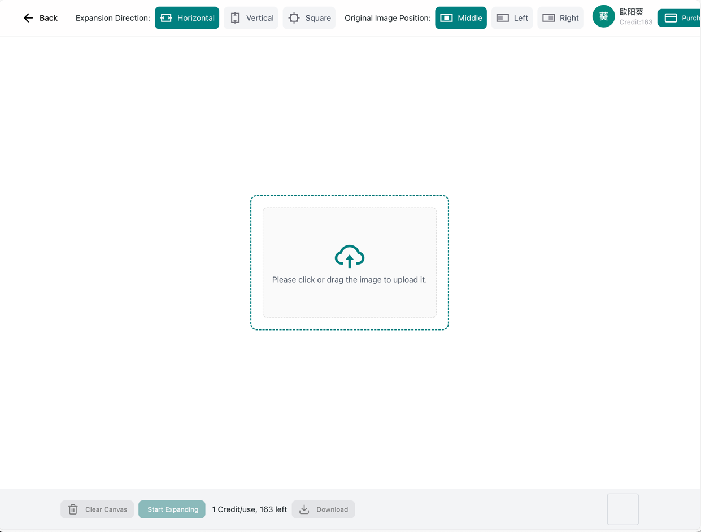
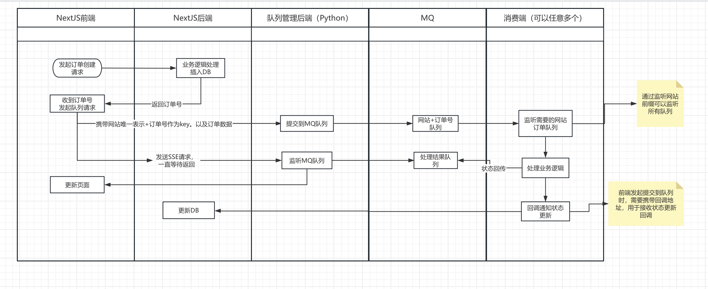

# 一套适用于各种AI图片工具站的代码模板

## 真实网站演示
- https://www.ai-outpaintig.com
## 网站截图
- 网站首页


- 价格页面


- 博客列表


- 图片编辑


## 项目介绍
- 1.基于nextjs 14 和 tailwindcss3 开发的AI扩图网站，网站地址：https://www.ai-outpainting.com/
- 2.网站需要配合后端AI模型使用。后端模型需要自行搭建。
  - 模型地址：https://huggingface.co/spaces/fffiloni/diffusers-image-outpaint
- 3.国际化采用lingui实现，这个对比next-intl 的好处是不需要为每个文案生成一个key,它会通过命令提取文案生成多语言文件。之后基于多语言文件去做翻译
- 4.项目编写了一些自动化脚本，如自动翻译国际化内容，自动翻译博客内容。这些都需要在有需要的时候手动运行
- 5.项目依赖数据库、cloudfare r2 存储、Google登录所需要的参数、paypal支付参数，这些参数都配置在.env和.env.production文件当中。
- 6.使用next-auth 集成google登录。本地开发时如果需要google登录，需要修改一些源码才可以，不然会报错。具体修改内容见下方说明
- 7.集成了paypal、stripe支付。本地开发使用的时沙盒环境，正式环境需要配置正式的paypal参数到.env.production文件当中
- 8.当前项目调用AI模型使用的方式大致如下：
  - 前端发起请求创建订单，携带订单号和当前网站订单状态更新回调地址，调用MQ队列管理器服务（这个是一个python开发的微服务,暂时没空整理代码）
  - 发起一个SSE请求到MQ队列管理服务后端，持续等待MQ队列管理器服务处理完成，并返回结果
  - 后端MQ队列管理器服务接收到请求后，直接将订单信息提交给MQ队列
  - GPU服务器监听MQ队列，获取到订单信息后，开始调用AI模型进行处理，处理完成后会做两件事：
    - 将处理结果上传到cloudfare r2 存储，并调用当前网站的订单状态更新回调地址
    - 将处理结果同时发送给MQ队列,由MQ队列管理器服务推送给前端，前端接收到处理结果后，将结果展示到前端页面
  - 整个过程不涉及网站直接和GPU服务器通信，都是通过MQ队列管理器服务来转发，文件都是通过R2存储中转，这样解决了GPU服务器和网站的耦合问题，如果订单量过大可以随时增加GPU服务器，而网站不需要做任何调整。
- 9.整体架构图如下：


- 10.另外一种实现方案
  - 前端创建订单后，页面通过轮询方式一直不停的查询订单状态，直到订单完成。
  - 后端有其他程序定时扫描数据库，获取到订单状态为pending的订单，获取到订单信息后，开始调用AI模型进行处理，处理完成后会做两件事：
    - 将处理结果上传到cloudfare r2 存储，并调用当前网站的订单状态更新回调地址去更新订单状态

- 11.如果有预算的也可以考虑直接使用runpod 的API服务,就不用自己实现MQ队列管理器服务器了，集成它的SDK就可以。
- 参考代码
```javascript
import runpodSdk, { EndpointCompletedOutput, EndpointIncompleteOutput } from 'runpod-sdk'
async function fetchProcessByRunPod(data: any): Promise<EndpointIncompleteOutput | undefined> {
  // const serverUrl = `${UE_PROCESS_API}/create_docker`
  // https://docs.runpod.io/serverless/endpoints/job-operations
  const runpod = runpodSdk("N5Jxxxxxxxxxxxxx");
  const endpoint = runpod.endpoint("1zgk5xi3ew77pv");
  console.log("start invoke runpod endpoint,data:",data)
  return endpoint?.run({
    "input": data,
  })
}
```
- 当前项目源码如果需要完整使用AI扩图功能，需要按上面的方式选择一种方案，修改app/[lang]/(editor)/editor/view.tsx文件当中创建订单和监听订单状态的逻辑 ！！！

## 其他注意事项
- 每次修改页面有新的内容后，需要执行 `yarn extract` 命令，将新的文案提取到国际化文件当中,并执行 `yarn translate` 命令将文案翻译为对应语言
- 如果有新增blog文章也需要执行一下 `yarn translate` 命令将新增的博客内容翻译为对应语言
- 翻译涉及到调用api，需要先申请到api key，然后修改一下scripts/openai-chat.js 当中的api key


## 基于模板上新站流程
### 1. 生成网站内容
- 直接使用node scripts/generator-website.js 命令生成网站内容(这个命令会指定关键词相关的文案、TDK、博客标题)
- 需要先修改一下关键词和描述，然后执行命令
- 
 ``` javascript
  // 网站关键词
const keyword = 'extend image ai'
// 网站该要描述
const description = '利用AI技术实现对图片进行扩展，在保证原始图片不变的前提下，扩展四周的内容，且能与原图片保持内容延续性'
- 修改config/site.ts当中的配置信息

 ```
### 2. 替换网站logo和标题等信息
- 将自己的logo favicon.ico 放到public/目录下，直接替换原文件
- 修改public/sitemap.xml 当中的域名
- 修改.env和.env.production当中的配置信息，具体修改要求查看注释

### 3.初始化数据库
- 当前项目采用prisma作为ORM框架，表结构声明在schema.prisma文件当中，第一次使用需要执行如下命令
```javascript
// 这个命令会根据表结构声明生成数据库表，并初始化表数据。如果有新的表字段更新都需要执行当前命令
 yarn pg:migrate 
 // 其他操作命令建议直接看prisma官方文档

 ```

### 4.修改网站配色
 - 网站的配色信息存放在tailwind.config.ts文件当中，如果需要修改配色，直接修改tailwind.config.ts文件当中的内容

### 5.系统部署
- 将代码提交到github.com然后使用vercel关联这个代码仓库部署即可，具体流程参考相关文档。


## 当前项目使用到的 UI 组件

- [1.纯 tailwindcss代码组件网站](https://tailspark.co/components)
  > 可以从网站上直接复制某些现成的组件代码完全基于 tw实现
- [2.纯 tailwindcss代码组件-floatui ](https://floatui.com/components)
  > 可以从网站上直接复制某些现成的组件代码完全基于 tw实现
- [3.组件化 UI 框架-nextui.org](https://nextui.org/)
  > 提供基于封装好的组件直接使用
- [4.表格组件-react-table](https://react-table-library.com/?path=/docs/getting-started-installation--page)
  > 提供基于封装好的组件直接使用，可以自定义样式，功能上基本能达到 vxe-table的水平
- [5.icon组件-react-icons](https://react-icons.github.io/react-icons/)
  > 提供多套默认 icon图标可以直接用
- [6.Form集成组件-react-hook-form](https://react-hook-form.com/)
  > 提供一些常用的表单交互api，便于实现表单的数据收集、回填、校验等
- [7.日志框架-winston](https://github.com/winstonjs/winston?tab=readme-ov-file#quick-start)
  > 服务端日志组件
- [8.Session管理](https://github.com/vvo/iron-session)
  > iron-session
- [9.Pricing页面生成](https://shipixen.com/)
  > shipixen
- [10.国际化](https://lingui.dev/)
  > 动态生成国际化文件
- [11.MDX博客](https://gaudion.dev/blog/nextjs-mdx-blog)
  > 基于MDX生成博客内容
- [12.Ant Design](https://ant-design.antgroup.com/components/upload-cn)
- >基于ant design组件实现的一些UI
## 数据库表结构更新后的操作
- 授予创建db的权限
```sql
-- aioutpaint 是当前项目数据库的用户名
ALTER ROLE aioutpaint CREATEDB;
```
> 本地执行时需要开启代理
`npx prisma migrate dev --name '说明'`
>


## next-auth表结构初始化
https://authjs.dev/getting-started/adapters/prisma
## 解决prisma在vercel构建时提示prisma generate的问题

https://www.prisma.io/docs/orm/more/help-and-troubleshooting/help-articles/vercel-caching-issue

# 解决本地无法打开Google登录问题
- 修改node_modules/@auth/core/node_modules/oauth4webapi/build/index.js
  - 修改后需要手动删除一下 .next目录，并重新编译
  - 1034  \1003 行，注释抛出的异常 有些新版本不一定是这一行，可以参考下面的点找到这个报错信息，然后注释掉

```javascript

 function validateIssuer(expected, result) {
  if (result.claims.iss !== expected) {
    // throw new OPE('unexpected JWT "iss" (issuer) claim value');
  }
  return result;
} 
  ```
- 250行，注释抛出的异常

```javascript
   if (new URL(json.issuer).href !== expectedIssuerIdentifier.href) {
  // throw new OPE('"response" body "issuer" does not match "expectedIssuer"');
}
```


## 版权声明
- 本项目采用MIT开源协议，请遵守协议内容
- 如果愿意的话，请帮我的网站留一个链接:https://www.ai-outpainting.com/ 非常感谢！

## 最后
- 如果项目对你有帮助，请给个star，非常感谢！
- 有技术问题欢迎添加微信交流：fafafa-ai